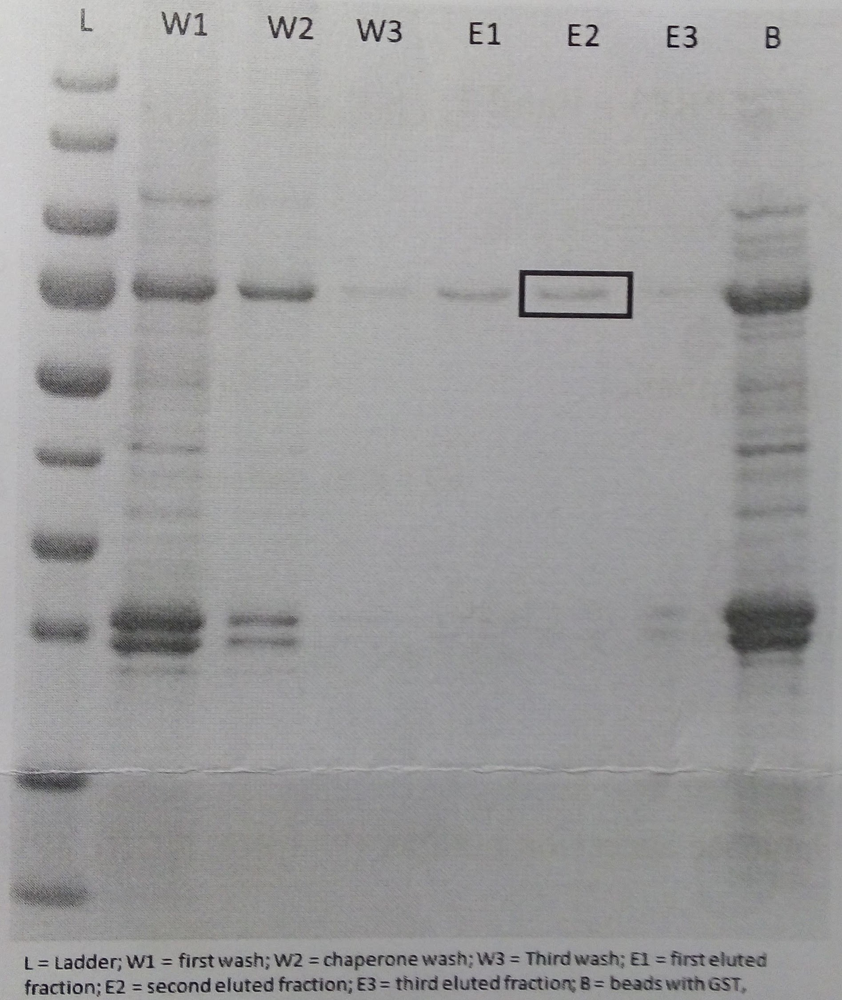
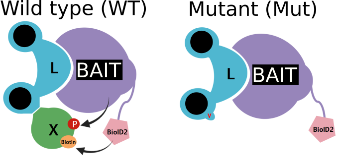
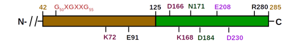
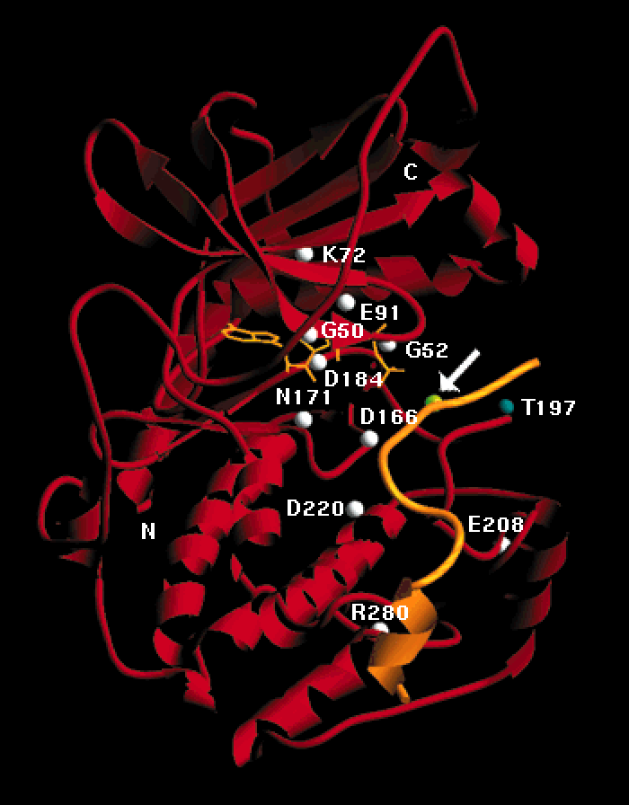

# WSBIM2115 - Relations structure/fonction des protéines

## Proteomics bioinformatics

### Mass spectrometry

- MS plays a central role for high-throughput proteomics.
- Review of how MS works.

### Peptide mass finderprinting

- Using the free [Matrix Science Mascot server](http://www.matrixscience.com/search_form_select.html)
- PMF input data. Serach the data against the human database using
  trypsin and setting 0 missed cleavages

```
802.5
967.4
712.9
656.8
932.0
1186.0
818.7
1063.0
1054.5
1646.1
1195.8
1153.3
1444.0
1050.4
1596.0
2193.0
1197.7
1834.2
2012.4
1228.3
2505.6
1328.7
2272.8
```

- What protein do you identify? Verify that you recover the masses in
  the input.

### MSMS search

- Download the [input data](./data/test.mgf) (in [mgf
  format](http://www.matrixscience.com/help/data_file_help.html)) and
  familiarise yourself with it.
- Plot (by hand if you prefer) one of these MSMS spectra. The smallest
  one is peak the 234th spectrum in the file (search for
  `TITLE=13161`).
- Run an MSMS search using the free [Matrix Science Mascot
  server](http://www.matrixscience.com/search_form_select.html). Use
  the following [data](./test.mgf), which is (part of) a MSMS run from
  a single protein band extracted from a gel. The protein of interest
  was [tagged with Glutathione S-transferase
  (GST)](https://en.wikipedia.org/wiki/Glutathione_S-transferase#GST-tags_and_the_GST_pull-down_assay)
  for purification.



- Use the following search parameters: Instrument *ESI-TRAP*, variable
  modification *oxidation*, search databases *contaminants and
  SwissProt*, enzyme *Trypsin* with up to 1 mis-cleavage, taxonomy
  *Homo sapiens*.
- Interpet the results: what proteins have been identified? Which one
  do you think was the one in the gel band? Why do you find more than
  one protein?

- The top hit above has been cut out of a unique gel band. It has been
  produced in vivo in an engineered *E. coli* strand. Repeat the
  search without the taxonomic group. What can you say?

### Interactomics

BioID (Roux *et al.*, 2012) is a technique based on proximity
labelling technique used to identify interacting partners.



Download this [BioID dataset](./data/BioID3.csv) (csv file). Based on
the principle demonstrated above, identify the most likely proteins X
that interact with the bait protein.


Roux, K. J., Kim, D. I., Raida, M. & Burke, B. [A promiscuous biotin
ligase fusion protein identifies proximal and interacting proteins in
mammalian cells](http://jcb.rupress.org/content/196/6/801). J. Cell
Biol. 196, 801–810 (2012).

### Conserved domains in cyclic AMP-dependent protein kinase (PKA)

- Find and download *cyclic AMP-dependent protein kinase (PKA)
  catalytic subunit (PKA)* sequences for the human
  ([P17612](https://www.uniprot.org/uniprot/P17612)), fly, chicken,
  xenophus, ... (and possibly a couple of other ones) from Uniprot.

- Align then using [Clustal
  Omega](https://www.ebi.ac.uk/Tools/msa/clustalo/).

- Identify which regions of the sequence are conserved.

Structure of the catalytic subunit of PKA (kinase domain):

- N-terminal: ATP binding
- C-terminal: substrate binding




- Glycine-rich region: binds the phospates of the ATP.
- K72: bind the alpha- and beta-phosphate of TAP.
- E91: when not active, glutamate 91 forms salt bridge with lysine
  168; breaks upon activation of the protein.
- K168: transition state stabilization.
- D166: base catalyst.
- D184, N171: Mg2+ binding (Mg-ATP)
- E208, D230: substrate binding (substrate RRXS recognition motif).
