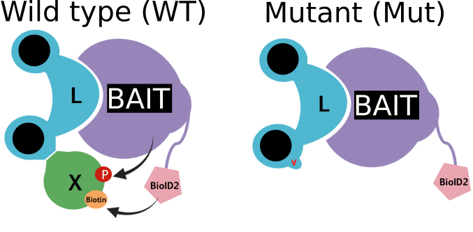
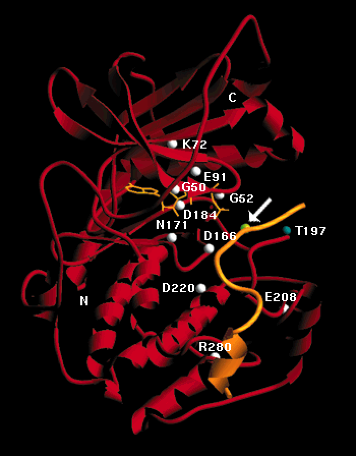

# Mass spectrometry

- MS plays a central role for high-throughput proteomics.
- Review of how MS works.

# Peptide mass fingerprinting 

- Using the free [Matrix Science Mascot
  server](http://www.matrixscience.com/search_form_select.html)

- Download the [PMF input data](./data/pmf.txt) and serach it] against
  the human database using trypsin and setting 0 missed cleavages.
  
- What protein do you identify? Verify that you recover the masses in
  the input.
  
# MSMS search

- Download the [input data](./data/test.mgf) (in [mgf
  format](http://www.matrixscience.com/help/data_file_help.html)) and
  familiarise yourself with it.
  
- Plot (by hand if you prefer) one of these MSMS spectra. The smallest
  one is the 234th spectrum in the file (search for `TITLE=13161`).
  
- The data is (part of) a MSMS run from a single protein band
  extracted from a gel. The protein of interest was [tagged with
  Glutathione S-transferase
  (GST)](https://en.wikipedia.org/wiki/Glutathione_S-transferase#GST-tags_and_the_GST_pull-down_assay)
  for purification.

---


---

- Run an MSMS search using the free [Matrix Science Mascot
  server](http://www.matrixscience.com/search_form_select.html) using
  the following search parameters: 
  
```
Instrument: ESI-TRAP
Variable modification: oxidation
Search databases: contaminants and SwissProt
Enzyme: Trypsin with up to 1 mis-cleavage
Taxonomy: Homo sapiens
```

- Interpet the results: What proteins have been identified? Which one
  do you think was the one in the gel band? Why do you find more than
  one protein?

- The top hit above, that was cut out of a *unique* gel band, has been
  produced in vivo in *E. coli*. Repeat the search without the
  taxonomic group. What can you say?

# Interactomics 

BioID (Roux *et al.*, 2012) is a technique based on proximity
labelling technique used to identify interacting partners.



Download this [BioID dataset](./data/BioID3.csv) (csv file). Based on
the principle demonstrated above, identify the most likely proteins X
that interact with the bait protein.


> Roux, K. J., Kim, D. I., Raida, M. & Burke, B. [A promiscuous biotin
> ligase fusion protein identifies proximal and interacting proteins
> in mammalian
> cells](http://jcb.rupress.org/content/196/6/801). J. Cell Biol. 196,
> 801–810 (2012).

---

```{r, echo = FALSE, warning = FALSE, fig.cap = "", fig.heigth = 10, fig.width = 12}
suppressPackageStartupMessages(library("tidyverse"))
suppressPackageStartupMessages(library("ggrepel"))
res <- suppressMessages(read_csv("data/BioID3.csv")) %>%
    rowwise() %>%
    mutate(pval = t.test(c(WT_1, WT_2, WT_3),
                         c(MUT_1, MUT_2, MUT_3))$p.value) %>%
    rowwise() %>%
    mutate(mean_wt = mean(c(WT_1, WT_2, WT_3)),
           mean_mut = mean(c(MUT_1, MUT_2, MUT_3))) %>%    
    mutate(logFC = log((mean_wt + 1) / (mean_mut + 1)))

ggplot(data = res,
       aes(x = logFC, y = -log10(pval),
           label = gene_symbol)) +
    geom_point() +
    geom_hline(yintercept = -log10(0.05)) + 
    geom_vline(xintercept = c(-1, 1)) +
    geom_text_repel(data = subset(res, pval < 0.01 & logFC > 0.5))
```


# Conserved domains in PKA

- Find and download *cyclic AMP-dependent protein kinase (PKA)
  catalytic subunit (PKA)* sequences for the human
  ([P17612](https://www.uniprot.org/uniprot/P17612)), fly, chicken,
  xenophus, ... (and possibly a couple of other ones) from Uniprot.

- Align then using [Clustal
  Omega](https://www.ebi.ac.uk/Tools/msa/clustalo/).

- Identify which regions of the sequence are conserved.


# Structure of the catalytic subunit of PKA (kinase domain) 


N-terminal: ATP binding; C-terminal: substrate binding

- Glycine-rich region: binds the phospates of the ATP (`GTGSFG`).
- K72: bind the alpha- and beta-phosphate of TAP (`AMKIL`).
- E91: when not active, glutamate 91 forms salt bridge with lysine
  168; breaks upon activation of the protein.
- K168: transition state stabilization (`YRDLK`).
- D166: base catalyst (`YRDLK`).
- D184 and N171: Mg2+ binding (Mg-ATP) (D184 and activation loop
  `DFGFAKRVKGRTWTLCGTPEYLAPE`)
- E208, D230: substrate binding (substrate RRXS recognition motif).

---


